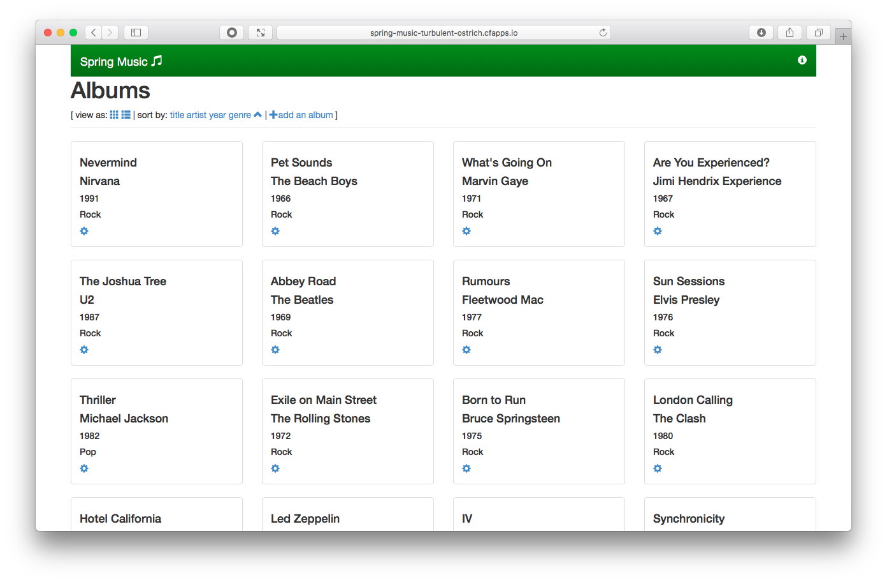
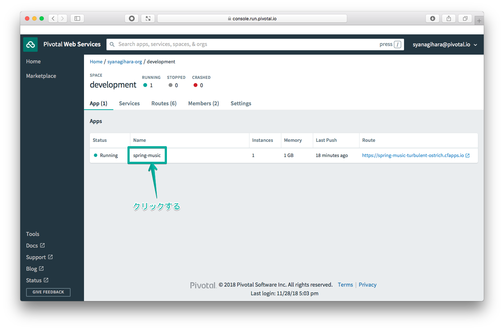
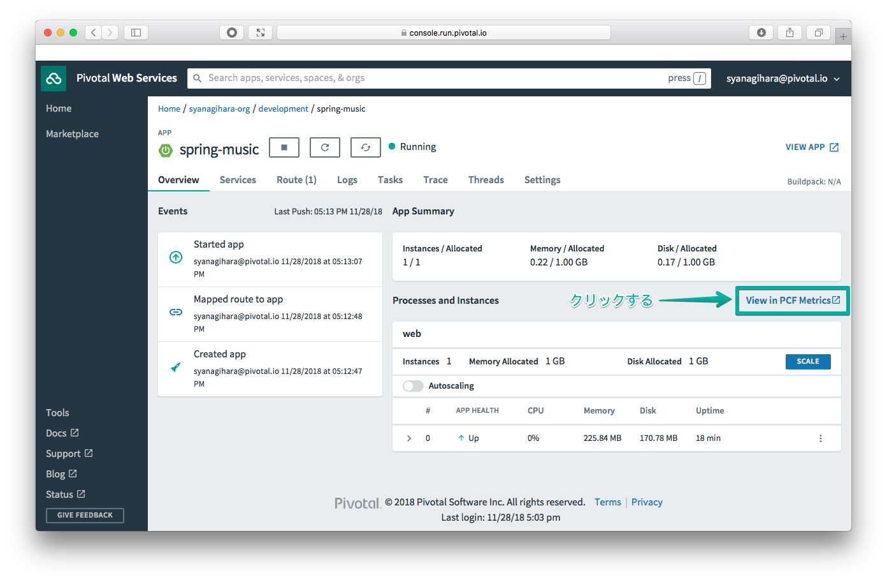
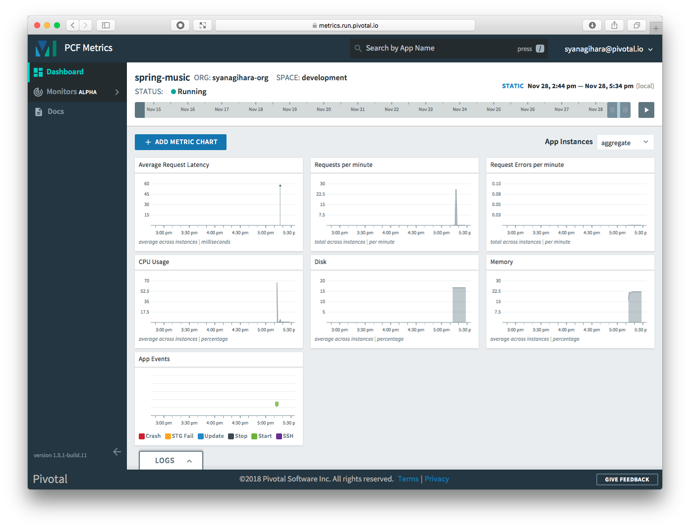
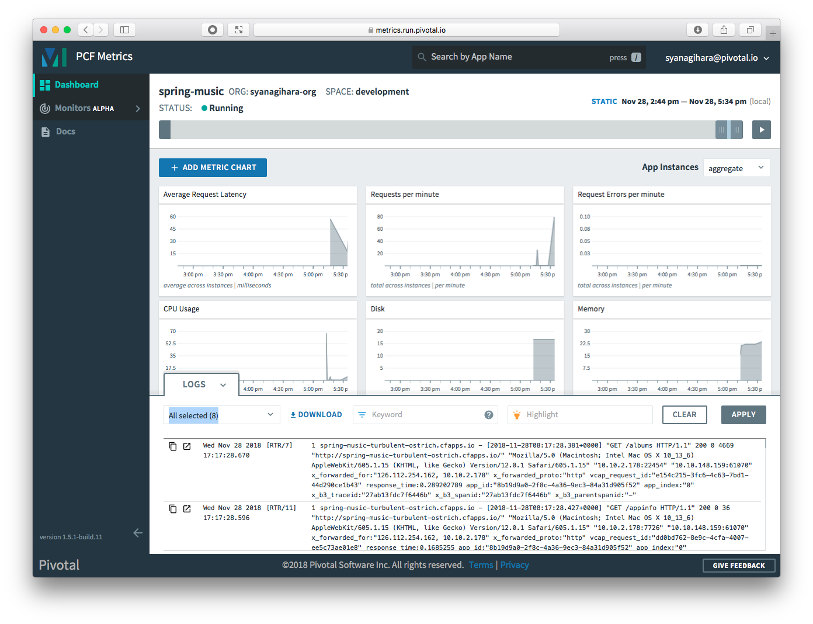
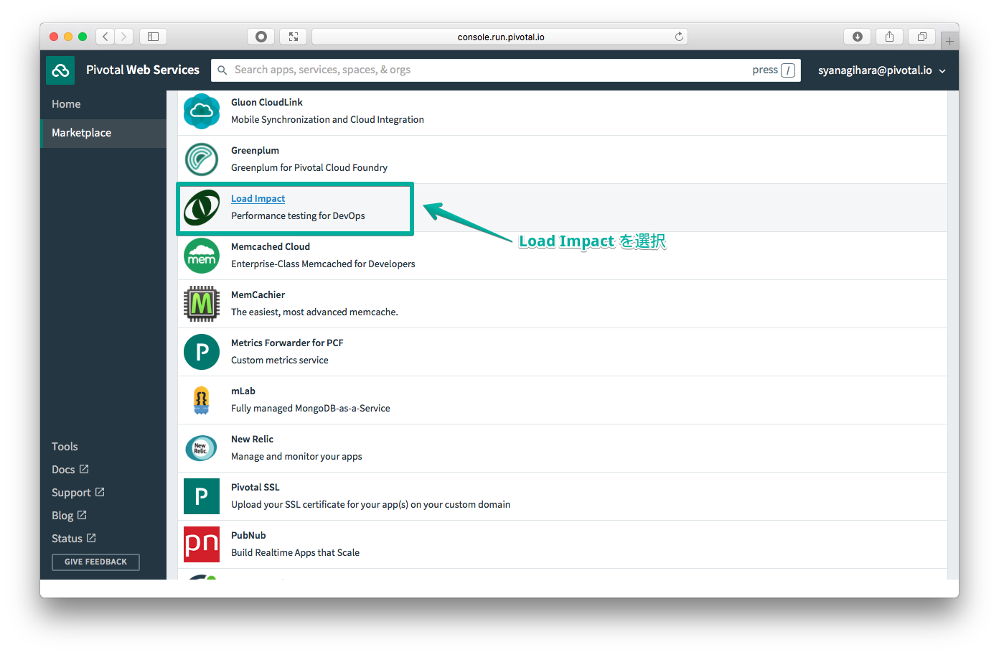

# Pivotal Cloud Foundry Metrics による アプリケーション診断
Pivotal Cloud Foundry Metrics を使用して、
Pivotal Cloud Foundry 上で実行しているアプリケーションのログ、メトリック、イベントデータを確認します。

## 概要 / 説明

### Pivotal Cloud Foundry Metrics
Pivotal Cloud Foundryとそのプラットフォーム上で稼働しているすべてのアプリケーションの
健全性とパフォーマンスを可視化し、次の課題に対する支援します。

- 何が、いつ問題になったのか？
  - アプリケーションメトリックがその答えを提示します。<br>メトリックは、長いネットワーク遅延が発生した場合のタイムウィンドウと平均応答時間を明示します。
- なぜ問題を起こしたか？
  - ログとメトリック (APIコール、正確な応答時間、渡されたパラメータなど) が、<br>なぜ遅延が発生したのかを解明するのに十分な情報を提供します。

#### Pivotal Cloud Foundry Metrics 表示情報

Pivotal Cloud Foundry Metricsは、次の情報を表示します。

- コンテナメトリック
  - CPU、メモリ、ディスク使用率のグラフ
- ネットワークメトリック：
  - リクエスト、HTTPエラー、応答時間のグラフ
- アプリケーションイベント
  - 更新、開始、停止、クラッシュ、SSH、ステージング失敗イベントのグラフ
- ログ
  - 追加の調査のために、検索、フィルタリング、ダウンロードが可能なアプリケーションログのリスト

## 前提 / 環境
- [事前作業](https://github.com/shinyay/pcf-workshop-prerequisite/blob/master/README.md)

## 手順 / 解説
### アプリケーションの準備
モニタリングする対象のアプリケーションを作成し、Pivotal Cloud Foundry にデプロイを行います。

#### プロジェクトの作成
GitHub 上に作成済みのプロジェクトをクローン(git clone)しプロジェクトを作成します。

- https://github.com/shinyay/spring-music.git

任意のディレクトリで、以下のコマンドを実行します。

```
$ mkdir pcf-workshop
$ cd pcf-workshop
$ git clone https://github.com/shinyay/spring-music.git
$ cd spring-music
```

#### アプリケーションのビルド
クローンしてきたアプリケーションは、**Gradle** でビルドを行うように構成されています。

アプリケーションのビルドは、以下の gradle コマンドを使用します。

```
$ ./gradlew clean assemble
```

ビルドが完了すると、`build/libs` 配下に Jar ファイルが生成されます。

```
$ ls -l build/libs

total 92304
-rw-r--r--  1 shinyay  staff  47255653 11 28 15:16 spring-music-1.0.jar
```

#### アプリケーションのデプロイ
ビルドしたアプリケーションを Pivotal Cloud Foundry へデプロイします。

アプリケーションのデプロイは、以下のコマンドを使用します。

```
$ cf push
```

<details><summary>実行結果</summary>

```
syanagihara@pivotal.io としてマニフェストから組織 syanagihara-org / スペース development にプッシュしています...
マニフェスト・ファイル /Users/shinyay/workspace/workshop/spring-music/manifest.yml を使用しています
アプリ情報を取得しています...
これらの属性でアプリを作成しています...
+ 名前:       spring-music
  パス:       /Users/shinyay/workspace/workshop/spring-music/build/libs/spring-music-1.0.jar
+ メモリー:   1G
  経路:
+   spring-music-turbulent-ostrich.cfapps.io

アプリ spring-music を作成しています...
経路をマップしています...
ローカル・ファイルをリモート・キャッシュと比較しています...
Packaging files to upload...
ファイルをアップロードしています...
 517.77 KiB / 517.77 KiB [==========================================================================================================================================================================================================================================] 100.00% 2s

API がファイルの処理を完了するのを待機しています...

アプリをステージングし、ログをトレースしています...
   Downloading dotnet_core_buildpack_beta...
   Downloading dotnet_core_buildpack...
   Downloading java_buildpack...
   Downloading staticfile_buildpack...
   Downloading python_buildpack...
   Downloaded dotnet_core_buildpack
   Downloading ruby_buildpack...
   Downloaded staticfile_buildpack
   Downloading nodejs_buildpack...
   Downloaded java_buildpack
   Downloaded ruby_buildpack
   Downloading php_buildpack...
   Downloaded nodejs_buildpack
   Downloading go_buildpack...
   Downloaded dotnet_core_buildpack_beta
   Downloading binary_buildpack...
   Downloaded python_buildpack
   Downloaded binary_buildpack
   Downloaded php_buildpack
   Downloaded go_buildpack
   Cell e222f891-b602-4a15-9b26-fd45771f60ad creating container for instance f6000a29-7bb2-46fb-b4e5-13c293f9686c
   Cell e222f891-b602-4a15-9b26-fd45771f60ad successfully created container for instance f6000a29-7bb2-46fb-b4e5-13c293f9686c
   Downloading app package...
   Downloaded app package (40.6M)
   -----> Java Buildpack v4.16.1 (offline) | https://github.com/cloudfoundry/java-buildpack.git#41b8ff8
   -----> Downloading Jvmkill Agent 1.16.0_RELEASE from https://java-buildpack.cloudfoundry.org/jvmkill/trusty/x86_64/jvmkill-1.16.0_RELEASE.so (found in cache)
   -----> Downloading Open Jdk JRE 1.8.0_192 from https://java-buildpack.cloudfoundry.org/openjdk/trusty/x86_64/openjdk-1.8.0_192.tar.gz (found in cache)
          Expanding Open Jdk JRE to .java-buildpack/open_jdk_jre (1.1s)
          JVM DNS caching disabled in lieu of BOSH DNS caching
   -----> Downloading Open JDK Like Memory Calculator 3.13.0_RELEASE from https://java-buildpack.cloudfoundry.org/memory-calculator/trusty/x86_64/memory-calculator-3.13.0_RELEASE.tar.gz (found in cache)
          Loaded Classes: 19546, Threads: 250
   -----> Downloading Client Certificate Mapper 1.8.0_RELEASE from https://java-buildpack.cloudfoundry.org/client-certificate-mapper/client-certificate-mapper-1.8.0_RELEASE.jar (found in cache)
   -----> Downloading Container Security Provider 1.16.0_RELEASE from https://java-buildpack.cloudfoundry.org/container-security-provider/container-security-provider-1.16.0_RELEASE.jar (found in cache)
   -----> Downloading Spring Auto Reconfiguration 2.5.0_RELEASE from https://java-buildpack.cloudfoundry.org/auto-reconfiguration/auto-reconfiguration-2.5.0_RELEASE.jar (found in cache)
   Exit status 0
   Uploading droplet, build artifacts cache...
   Uploading build artifacts cache...
   Uploading droplet...
   Uploaded build artifacts cache (129B)
   Uploaded droplet (87.3M)
   Uploading complete
   Cell e222f891-b602-4a15-9b26-fd45771f60ad stopping instance f6000a29-7bb2-46fb-b4e5-13c293f9686c
   Cell e222f891-b602-4a15-9b26-fd45771f60ad destroying container for instance f6000a29-7bb2-46fb-b4e5-13c293f9686c

アプリが開始するのを待機しています...

名前:                   spring-music
要求された状態:         started
経路:                   spring-music-turbulent-ostrich.cfapps.io
最終アップロード日時:   Wed 28 Nov 17:13:26 JST 2018
スタック:               cflinuxfs2
ビルドパック:           client-certificate-mapper=1.8.0_RELEASE container-security-provider=1.16.0_RELEASE java-buildpack=v4.16.1-offline-https://github.com/cloudfoundry/java-buildpack.git#41b8ff8 java-main java-opts java-security jvmkill-agent=1.16.0_RELEASE
                        open-jd...

タイプ:           web
インスタンス:     1/1
メモリー使用量:   1024M
開始コマンド:     JAVA_OPTS="-agentpath:$PWD/.java-buildpack/open_jdk_jre/bin/jvmkill-1.16.0_RELEASE=printHeapHistogram=1 -Djava.io.tmpdir=$TMPDIR -Djava.ext.dirs=$PWD/.java-buildpack/container_security_provider:$PWD/.java-buildpack/open_jdk_jre/lib/ext
                  -Djava.security.properties=$PWD/.java-buildpack/java_security/java.security $JAVA_OPTS" && CALCULATED_MEMORY=$($PWD/.java-buildpack/open_jdk_jre/bin/java-buildpack-memory-calculator-3.13.0_RELEASE -totMemory=$MEMORY_LIMIT -loadedClasses=20325
                  -poolType=metaspace -stackThreads=250 -vmOptions="$JAVA_OPTS") && echo JVM Memory Configuration: $CALCULATED_MEMORY && JAVA_OPTS="$JAVA_OPTS $CALCULATED_MEMORY" && MALLOC_ARENA_MAX=2 SERVER_PORT=$PORT eval exec $PWD/.java-buildpack/open_jdk_jre/bin/java
                  $JAVA_OPTS -cp $PWD/. org.springframework.boot.loader.JarLauncher
     状態   開始日時               cpu    メモリー           ディスク           詳細
#0   実行   2018-11-28T08:13:54Z   0.0%   1G の中の 104.5M   1G の中の 170.8M

```
</details>

`経路` に表示される URI にアクセスします。

上記例の場合、`http://pring-music-turbulent-ostrich.cfapps.io` にアクセスします。
以下のような画面が表示される事が確認できます。



### Pivotal Cloud Foundry Metrics
#### Apps Manager の表示
まず、**Apps Manager** にアクセスします。

各スペースにデプロイされているアプリケーション一覧が表示されている事が確認できます。
表示されているアプリケーションから、デプロイを行った `spring-music` をクリックします。



アプリケーション名をクリックすると、各アプリケーションの詳細情報が表示されます。
この個別アプリケーション情報画面の中央右部に **View in PCF Metrics** をクリックします。



#### Pivotal Cloud Foundry Metrics の表示
以下のような様々なチャートが掲載されているダッシュボード画面が表示されます。
この画面が Pivotal Cloud Foundry Metrics です。



#### ログの表示
画面下部にある **LOGS** をクリックすると、アプリケーションが出力したログが表示されます。


### Pivotal Cloud Foundry Metrics の利用
#### 高トランザクションの発生
##### 負荷ツールの導入
[Apps Manager](https://console.run.pivotal.io) から **Marketplace** を利用して、
**Load Impact** という負荷ツールを導入します。

Marketplace から Load Impact を見つけ、選択します。




## まとめ / 振り返り
